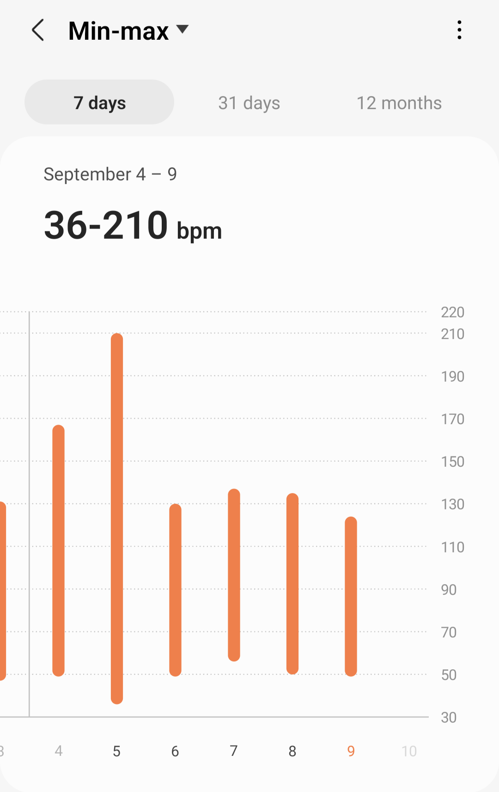
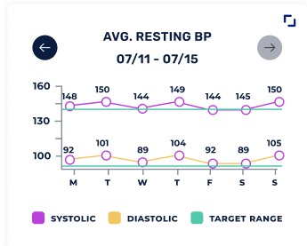
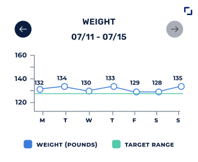

# Carda Health API
## The scenario
Suppose that we have an existing smartphone app that allows patients to chat with their doctor.
We want to extend this app so we can record information about the patient’s vital signs.

Here are the product requirements:

- We’ll provide patients with a new wearable device that tracks several vital signs throughout the day. The patient will wear this device on their wrist and the sensor will periodically send data to our smartphone app via Bluetooth. Our app will then send this data to our backend.

- The wearable device and app will record the following vitals while the patient is wearing
the device:
    - Heart rate. This value is measured continuously during the day, once a second.
    - Blood pressure. This is measured twice a day, once in the morning and once in the evening. There are two values per measurement: systolic and diastolic.
- The app will periodically prompt the patient to enter additional vitals information into the app. For now, we’re starting with:
    - Weight. Patients will be prompted to input this information once a day.
- The app will show the patient some summary statistics of these vitals:
    - Heart rate over time. The patient can view a graph of their heart rate over the last 7 days, 31 days, and 12 months. The graph will show a range from minimum to maximum for each day, but it won’t show all the individual heart rate values. Here’s an example screenshot of the “7 days” view.



- - Blood pressure over time. The patient can view a graph of their blood pressure over the last 7 days, 31 days, and 12 months. The graph will show two series: one for the systolic measurement, another for the diastolic measurement. Here’s an example screenshot of the “7 days” view:



- - Weight over time. The patient can view a graph of their weight over the last 7 days, 31 days, and 12 months. Here’s an example screenshot of the “7 days view”:



- The patient won’t see the raw data behind these summary statistics, but we need to store all of the raw data for later analysis.

## Your tasks
We’d like you to build the backend for storing, processing, and retrieving this vitals data for later use within the app. In particular:
- Design and implement a data model to store this information. Assume that it will be stored within a SQL database. Make sure your code clearly identifies the entities and relationships between them.
- Design and implement an HTTP API that the smartphone app will use to store and retrieve vitals data from the backend. Make sure your code clearly identifies the API endpoints and their request/response payloads.
- Write any additional code that you believe is necessary to support the functionality of the API.

## Proposed Solution
**Project Structure**
```
├── src
│   ├── infra
│   │   ├── config.py
│   │   └── db.py
│   ├── models
│   │   ├── heart.py
│   │   ├── weight.py
│   │   └── blood.py
│   ├── schemas
│   │   └── vital_signs.py
│   └── app.py
└── requirements.txt
```

**requirements.txt:**

```
fastapi
uvicorn
pydantic
```

**Configuring:**

1. **Virtual environment:**
   ```bash
   python3 -m venv .venv
   source .venv/bin/activate
   ```

2. **Install dependencies:**
   ```bash
   pip install -r requirements.txt
   ```

**Running:**
1. **Server:**
   ```bash
   uvicorn backend.app:app --reload
   ```

**Observations**
- I'm checking the official docs of FastAPI during the development:
https://fastapi.tiangolo.com/reference/
- I tryed to use postgresql using sqlalchemy to acess the data
- I organized the project separating the concerns using the best practices
- I prefer not to get into those database configuration right now and spend time in the business logic, so put some db interface to represent it for now, but in the next steps might be do those work.